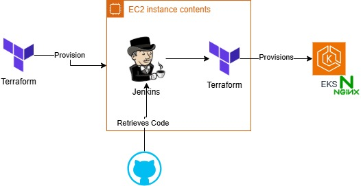

# terraform-jenkins-aws

## Architecture

## Why IaC? 

- Infrastructure as Code (IaC) is the process of managing and provisioning infrastructure through code.
- IaC allows you to create, update, and destroy infrastructure in a consistent and repeatable manner.
- IaC enables you to manage infrastructure changes in a way that is easy to understand, test, and roll back.

## Setting up EKS cluster using Jenkins via via Terraform

- JenkinsFile script pulls code from GitHub repository
- JenkinsFile script runs Terraform code to create/destroy EKS cluster
- Terraform code creates/destroys EKS cluster, VPC, subnets, security groups, etc.
